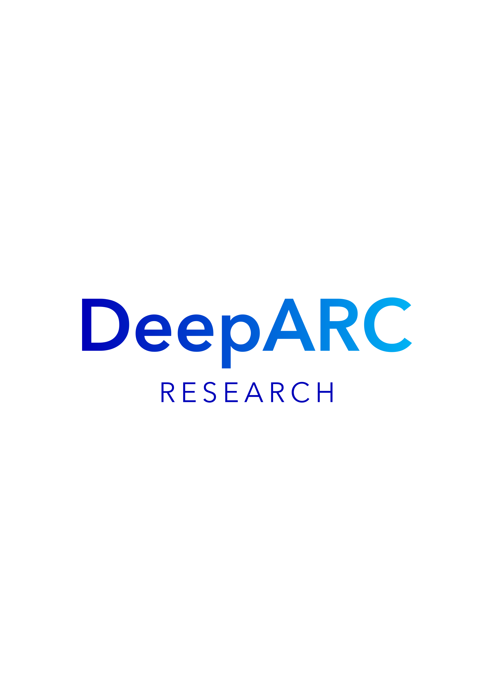

  

This research group is partially funded by Yachay Tech University and Universidad Internacional del Ecuador (UIDE).

## Publications

Explore our latest research articles:

- **[Title of Publication 1](https://doi.org/example1)**  
  Description of the publication. [Code Repository](https://github.com/DeepARC/CodeExample1)

- **[Title of Publication 2](https://doi.org/example2)**  
  Description of the publication. [Code Repository](https://github.com/DeepARC/CodeExample2)

- **[Title of Publication 3](https://doi.org/example3)**  
  Description of the publication. [Code Repository](https://github.com/DeepARC/CodeExample3)

## Team Members

Meet the researchers behind DeepARC:

### Eugenio Morocho
**Coordinator of DeepARC Research Group**  
  
Eugenio leads the DeepARC team with a focus on wireless networks and the integration of artificial intelligence in engineering processes.

### Member 2
**AI and Wireless Networks Researcher**  
  
This team member specializes in the development of AI solutions for communication networks.

### Member 3
**Computer Vision Specialist**  
  
Focused on image analysis and the development of models for object recognition and pattern detection.

### Member 4
**Data Analysis Expert**  
  
Specializes in handling large datasets and extracting insights through machine learning techniques.

### Member 5
**Robotics Specialist**  
  
Works on designing and optimizing intelligent robotic systems, with applications in industrial process automation.

### Member 6
**Machine Learning Engineer**  
  
This team member has expertise in creating predictive models and implementing deep learning algorithms.

### Member 7
**Natural Language Processing Expert**  
  
Focused on developing AI applications that understand and generate human language, improving system interactions.

### Member 8
**Cloud Computing Specialist**  
  
With expertise in cloud infrastructure, this member contributes to the development of scalable solutions for large-scale data processing.

---

&copy; 2024 DeepARC Research Group
